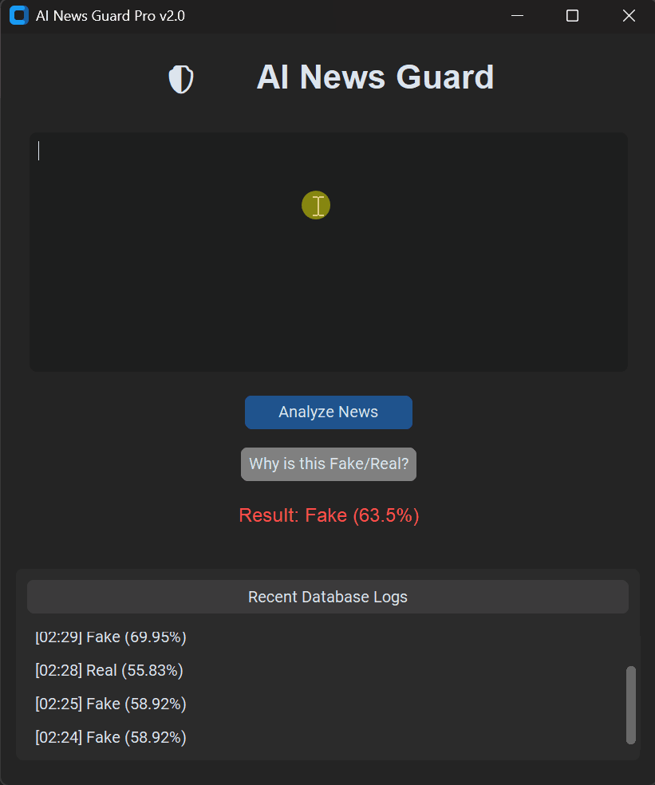

# 🛡️ AI News Guard  
### Real-Time Misinformation Detection with Explainable AI

<p align="center">
  
</p>

<p align="center">
  
  
  
  
  
</p>

---

## 📌 Overview

**AI News Guard** is a production-style Machine Learning application designed to detect fake news articles in real time.

It not only predicts whether an article is **Fake** or **Real**, but also explains *why* — using model-driven keyword transparency (Explainable AI).

> ⚡ Built to demonstrate strong understanding of NLP, model training, and deployment-ready architecture.

---

## ✨ Key Features

- 🧠 Logistic Regression based classifier  
- 📊 TF-IDF Vectorization  
- 🔎 Explainable AI (Keyword Highlighting)  
- 📈 Confidence Score Output  
- ⚡ Real-time text prediction  
- 🗄️ MySQL database integration  
- 🧹 Automated dataset preprocessing pipeline  

---

## 🏗️ Project Architecture

```
User Input (News Text)
        │
        ▼
Text Preprocessing (NLTK)
        │
        ▼
TF-IDF Vectorization
        │
        ▼
Logistic Regression Model
        │
        ├── Prediction (Fake / Real)
        └── Confidence Score
        │
        ▼
Explainable AI Layer
(Top Weighted Keywords)
        │
        ▼
Frontend Output
```

---

## 📸 Visual Demonstration

### 🎥 Live Application Demo

<p align="center">
  
</p>

---

### 🔍 Explainable AI Popup

<p align="center">
  
</p>

---

## ⚙️ How It Works

### 1️⃣ Data Preprocessing
- Cleaned 40,000+ articles
- Removed stopwords using `NLTK`
- Lowercasing, punctuation removal
- Label encoding

### 2️⃣ Feature Engineering
- TF-IDF vectorization
- High-dimensional sparse matrix generation

### 3️⃣ Model Training
- Logistic Regression classifier
- Balanced training dataset
- Performance validation

### 4️⃣ Explainability Layer
- Extracted model coefficients
- Highlighted suspicious high-weight words
- Generated transparency insights

---

## 📊 Dataset

This project uses the **ISOT Fake News Dataset** (~44,000 articles).

### Setup Steps

1. Download:
   - `True.csv`
   - `Fake.csv`
2. Place them inside:

```
/data
```

3. Run preprocessing:

```bash
python prep_data.py
```

---

## 🚀 Installation & Running

### 🔹 Prerequisites

- Python 3.11+
- XAMPP (for MySQL management)

---

### 🔹 Clone Repository

```bash
git clone https://github.com/kmlPokhrel/fake-news-detector.git
cd fake-news-detector
```

---

### 🔹 Install Dependencies

```bash
pip install -r requirements.txt
```

---

### 🔹 Run Application

```bash
python app.py
```

---

## 📈 Model Performance

| Metric        | Score |
|--------------|--------|
| Accuracy     | 98%+   |
| Precision    | High   |
| Recall       | High   |
| F1-Score     | Strong |

> Performance may vary slightly depending on train-test split.

---

## 🧰 Tech Stack

- Python 3.11+
- Scikit-learn
- NLTK
- Pandas
- NumPy
- MySQL
- HTML/CSS (Frontend)

---

## 📂 Project Structure

```
fake-news-detector/
│
├── app.py
├── prep_data.py
├── model/
├── data/
├── assets/
├── requirements.txt
└── README.md
```

---

## 🛠️ Future Improvements

- 🧠 Upgrade to BERT / Transformer models
- 🌐 Deploy on cloud (Render / AWS / GCP)
- 📊 Add model comparison dashboard
- 🔐 User authentication system
- 📱 Convert to API-based service

---

## 🤝 Contribution

Contributions are welcome!

1. Fork the repository  
2. Create a new branch  
3. Commit changes  
4. Open a Pull Request  

---

## 📜 License

This project is licensed under the **MIT License**.

---

<p align="center">
Developed with ❤️ 
</p>
